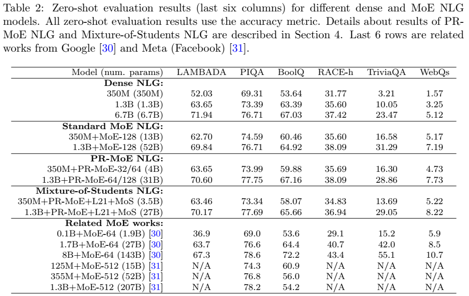
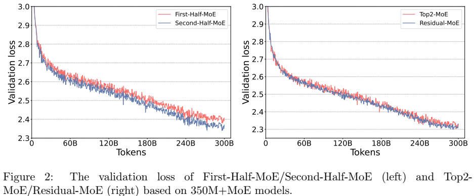
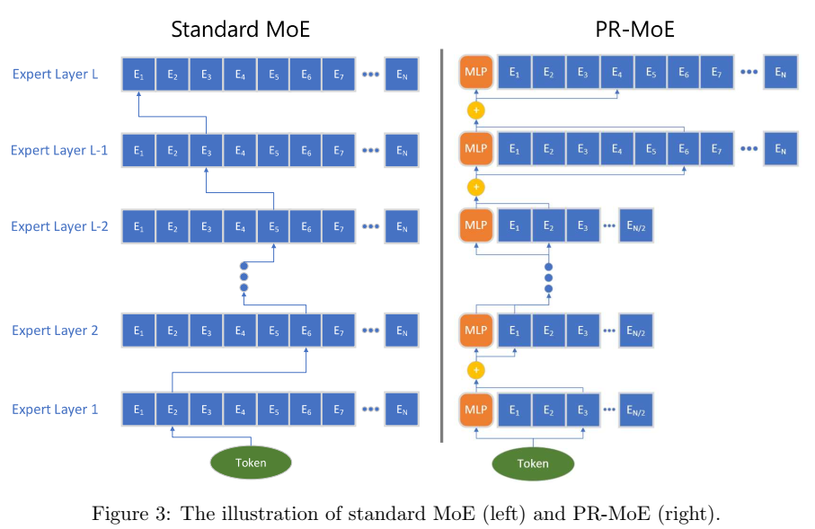
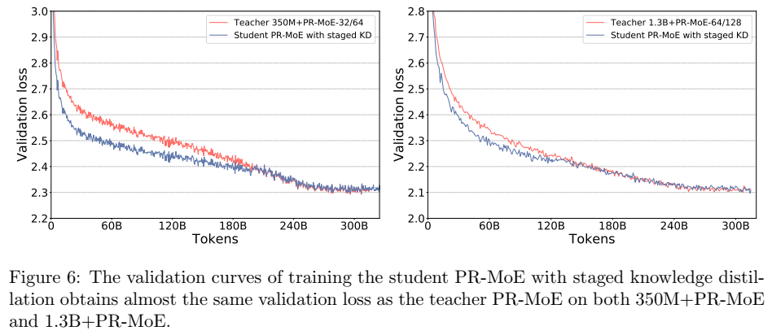
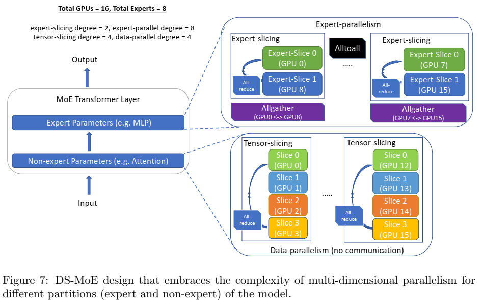
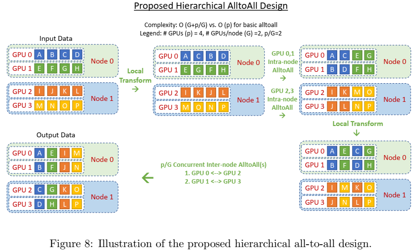
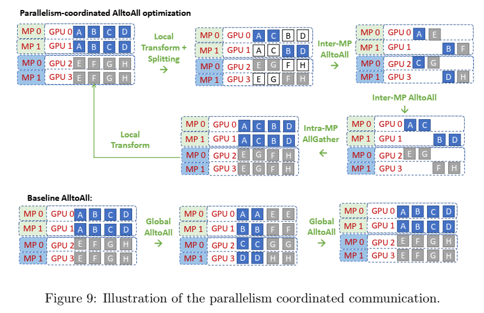
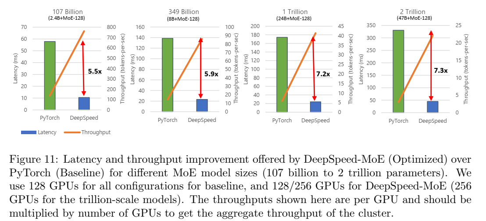
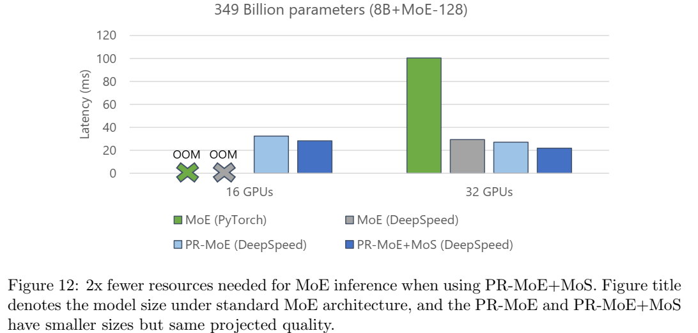
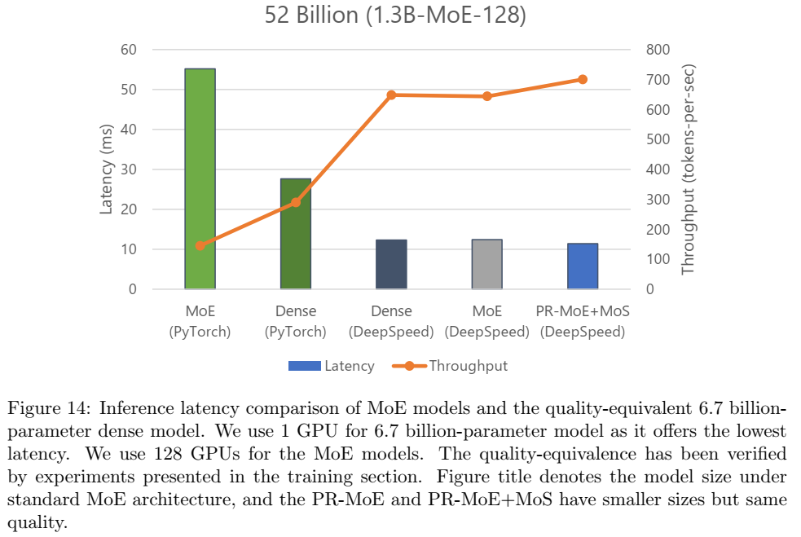

# DeepSpeed-MoE: Advancing Mixture-of-Experts Inference and Training to Power Next-Generation AI Scale

### 摘要

专家混合模型 (MoE) 由于其与质量相当的稠密模型相比显著降低了训练成本，成为最有前景的模型架构之一。然而，由于模型尺寸更大且架构独特，如何提供快速 MoE 模型推理仍然是一个挑战，尚未解决，限制了其实际应用。为了解决这个问题，作者提出了 DeepSpeed-MoE，它是 DeepSpeed 库中的一个<u>端到端 MoE 训练和推理解决方案</u>，包括<u>新颖的 MoE 架构设计和模型压缩技术</u>，这些技术可以将 MoE 模型大小减少高达 3.7 倍，以及一个<u>高度优化的推理系统</u>，与现有的 MoE 推理解决方案相比，该系统提供了 7.3 倍的延迟和成本优势。DeepSpeed-MoE 为大规模 MoE 模型提供了前所未有的规模和效率，与质量相当的稠密模型相比，推理速度快 4.5 倍，成本低 9 倍。

### 引言

由于计算需求不断增加，维持模型规模的增长变得越来越困难。例如，截至 2021 年 12 月，现存最大的单一稠密模型 Megatron-Turing NLG 530B 模型，在 NVIDIA Selene 超级计算机上使用超过 2000 个 A100 GPU 训练了大约 3 个月，消耗了超过 300 万个 GPU 小时。在合理的时间范围内，密集模型尺寸再增加 3 到 5 倍是不切实际的。为了在不牺牲模型质量的情况下减少训练大型模型的计算需求，人们发现基于混合专家 (MoE) 的架构十分具有前景。同时也面临一系列挑战：

- 应用范围有限。MoE 基于模型在 NLP 领域的应用范围主要局限于编码器-解码器模型和序列到序列任务，在探索其在其他领域的应用方面工作有限。MoE 在<u>自回归自然语言生成 (NLG) 方面的应用</u>，例如 GPT-3 和 MT-NLG 530B，其训练最先进语言模型的计算成本可能比编码器-解码器模型高出几个数量级，<u>这方面的探索较少</u>。
- 内存需求巨大。尽管 MoE 模型在达到与密集模型相同的模型质量方面需要更少的计算量，但它们<u>需要显著更多的参数数量</u>。并且，与质量相当的密集模型相比，基于 MoE 的模型的<u>“参数效率”要低得多</u>。更大的模型尺寸和更低的参数效率给训练和推理都带来了挑战。
- 推理表现受限。由于上述大型模型尺寸和参数效率低下，基于 MoE 的模型的快<u>速推理更加困难</u>。一方面，更大的参数尺寸需要更多 GPU 来容纳，而多 GPU 推理技术并非为基于 MoE 的模型而设计。另一方面，由于推理通常受内存带宽限制，基于 MoE 的模型（其大小可能是其密集等效模型的 10 倍）可能需要 10 倍更高的可实现内存带宽才能实现与密集模型类似的推理延迟。

为了使 MoE 变得实用、易于访问和适用，作者通过提供三种相应的解决方案来解决这些挑战：

- 作者将 MoE 模型的应用范围扩展到自回归 NLG 任务，展示了训练成本降低 5 倍，以实现与 GPT-3 和 MTNLG 等模型相同的模型质量。
- 作者通过开发一种名为金字塔残差 MoE (PR-MoE) 的新型 MoE 架构来提高基于 MoE 模型的参数效率。<u>PR-MoE 是一种混合密集和 MoE 模型，使用残差连接创建，同时仅在专家最有效的地方应用专家。</u>PR-MoE 可以将 MoE 模型参数大小减少多达 3 倍，而不会改变模型质量，并且对计算需求的影响最小。此外，作者通过<u>分阶段知识蒸馏创建了 PR-MoE 的蒸馏版本</u>，作者称之为混合学生 (MoS)。MoS 将 MoE 模型大小减少了多达 3.7 倍，同时保持了相当的模型质量。
- 作者开发了 DeepSpeed-MoE 推理系统，这是一个高度优化的 MoE 推理系统，它能够在数百个 GPU 上高效地扩展推理工作负载，与现有的 MoE 推理解决方案相比，推理延迟和成本降低了 7.3 倍。它为万亿参数 MoE 模型提供超快的推理延迟（低于 25 毫秒）。DeepSpeed-MoE 还通过结合系统和模型优化，为 MoE 模型提供比质量相当的稠密模型快 4.5 倍、便宜 9 倍的推理。

### 相关工作

主要讨论了三个主题：大规模密集型自然语言处理（NLP）模型、通过 Mixture-of-Experts（MoE）架构降低训练成本的方法，以及 MoE 模型的训练和推理系统。

1. **大规模密集型 NLP 模型**：

   - 论文回顾了近年来 NLP 领域模型规模的增长，从几百兆参数到半兆参数的模型，例如 BERT、XLNet、RoBERTa、ALBERT 和 GPT 等。
   - 讨论了这些模型在各种自然语言理解和生成任务上的表现，并指出了模型规模的增加带来的计算需求的增长。
2. **通过 MoE 架构降低训练成本**：

   - 论文探讨了使用 MoE 架构来减少训练大型模型所需的计算资源的方法。MoE 通过引入专家混合来实现模型参数和计算需求的亚线性增长。
   - 举例说明了 MoE 在不同模型中的应用，如 LSTM、Transformer 等，并讨论了 MoE 如何在保持模型质量的同时减少训练成本。
3. **MoE 模型的训练和推理系统**：

   - 论文提到了目前开源系统和框架正在开发或扩展以支持 MoE 模型的训练，但指出目前还没有专门为推理优化的 MoE 系统。
   - 讨论了一些现有的 MoE 训练系统，例如 DeepSpeed MoE 训练系统，以及其他一些研究工作，它们提供了不同程度上的 MoE 模型训练支持。
     论文的这一部分为读者提供了一个背景，说明了 MoE 模型在 NLP 领域的研究进展，以及它们如何帮助解决大规模模型训练中的计算挑战。同时，它也突出了 MoE 模型在实际应用中面临的挑战，特别是在模型推理方面的性能问题，并为论文提出的 DeepSpeed-MoE 解决方案提供了研究基础。

### DeepSpeed-MoE 用于 NLG：将语言模型训练成本降低 5 倍

1. 基于 MoE 的 NLG 模型架构

为了创建基于 MoE 的 NLG 模型，作者研究了类似 GPT 的基于 Transformer 的 NLG 模型。为了在合理的时间范围内完成训练，作者选择了以下模型：350M（24 层，1024 隐藏大小，16 个注意力头）、1.3B（24 层，2048 隐藏大小，16 个注意力头）和 6.7B（32 层，4096 隐藏大小，32 个注意力头）。作者使用“350M+MoE-128”来表示一个 MoE 模型，该模型使用 350M 稠密模型作为基础模型，<u>并在每隔一个前馈层添加 128 个专家</u>。也就是说，350M+MoE-128 和 1.3B+MoE-128 总共有 12 个 MoE 层。

作者在 MoE 层中<u>使用门控函数来激活每个 token 的专家子集。</u>具体来说，在作者的实验中，只选择了排名第一的专家。因此，<u>在训练和推理期间，作者的 MoE 模型将为每个 token 激活与密集部分相同数量的参数。</u>例如，1.3B+MoE128 将只激活每个 token 的 1.3B 个参数，并且每个 token 的训练计算量将类似于 1.3B 个稠密模型。作者还测试了 top-2 门控函数，发现它提供了一些收敛改进，但它是一个递减的回报，并且与 top-1 门控相比，它带来了大量的训练计算/通信开销。

1. 训练与评估

1. MoE 可提升 NLG 模型的质量

图 1 显示，模型的 MoE 版本的验证损失明显优于其密集对应版本。此外，请注意，MoE 模型 350M+MoE-128 的验证损失与 1.3B 密集模型（基础模型大 4 倍）的验证损失相当。这也适用于与 6.7B 稠密模型相比，其基础模型大 5 倍的 1.3B+MoE-128。

此外，模型质量不仅在验证损失方面，而且在表 2 所示的 6 个下游任务（1 个完形填空预测任务 (LAMBADA ), 1 个常识推理任务 (PIQA ), 2 个阅读理解任务 (BoolQ ）, RACEh), 以及 2 个问答任务 (TriviaQA , WebQs)）的零样本评估方面也相当，这表明 MoE 模型及其基础模型大 4-5 倍的稠密对应模型具有非常相似的模型质量。

尽管训练数据和超参数并不相同，但比较表明，<u>在某些任务上，作者的 MoE 模型能够以更少的参数数量实现相同或更好的质量</u>：与 [30] 中的 8B+MoE-64 (143B) 相比，作者的 MoE 模型 (1.3B+MoE-128 (52B), 1.3B+PR MoE-64/128 (31B), 1.3B+PR-MoE+L21+MoS (27B)) 能够以最多 5.3 倍的参数数量实现更高的 LAMBADA 准确率。与 [31] 中的 355M+MoE-512 (52B) 相比，作者的 MoE 模型 (1.3B+PR-MoE-64/128 (31B) 和 1.3B+PR-MoE+L21+MoS (27B)) 能够在参数数量减少高达 1.9 倍的情况下，在 PIQA/BoolQ 上取得更高的准确率。

1. 训练成本降低 5 倍，但质量相同

显而易见，在 NLG 模型中添加具有 128 个专家的 MoE 显着提高了 NLG 模型的质量。然而，<u>这些专家不会改变模型的计算需求</u>，因为每个 token 只由一个专家处理。因此，具有相同基底的稠密模型及其对应的 MoE 模型的计算需求相似。更具体地说，训练一个 1.3B+MoE-128 模型所需的计算量与训练一个 1.3B 稠密模型所需的计算量大致相同，同时提供了更好的模型质量。

此外，实验结果表明，通过应用 MoE，作者可以在 1.3B 参数稠密模型的训练成本下实现 6.7B 参数稠密模型的模型质量，从而有效地将训练计算量减少 5 倍。

### PR-MoE 和 MoS：减小模型尺寸并提高参数效率

虽然基于 MoE 的模型在 NLG 例子中以 5 倍的训练成本降低实现了相同的质量，但生成的模型的参数量大约是相应稠密模型的 8 倍（例如，6.7B 稠密模型有 67 亿个参数，而 1.3B+MoE-128 有 520 亿个参数）。为了减少参数数量并提高 MoE 的参数效率，作者通过减少模型整体大小最多 3 倍来实现，而不会影响模型质量。此外，作者设计了一种新颖的 MoE 到 MoE 的知识蒸馏技术，以创建 PR-MoE 的蒸馏版本，作者称之为混合学生 (MoS)，它进一步减小了 MoE 模型的大小，优化了推理时间和成本。

- 现象一 ：

首先，<u>标准的 MoE 架构在所有 MoE 层中具有相同数量和结构的专家</u>。这提醒作者在机器学习领域中的一个基本问题：深度神经网络中的所有层都学习相同的表示吗？这个问题在计算机视觉 (CV) 中得到了很好的研究：浅层（靠近输入）学习通用表示，而深层（靠近输出）学习更具体的表示。这也启发了 CV 中的迁移学习，以冻结浅层用于微调。然而，这种现象在自然语言处理中，特别是对于 MoE 架构，尚未得到充分探索。

为了研究这个问题，作者比较了两种基于 350M+MoE 模型的不同 Half-MoE 架构的性能。更具体地说，<u>a)</u> 作者将 MoE 层放在模型的前半部分层，并将后半部分层保持与密集模型相同（称为 First-Half-MoE），<u> b)</u> 作者将 MoE 层切换到后半部分，并在前半部分使用密集层（称为 Second-Half-MoE）。结果如图 2（左）所示。可以看出，Second-Half-MoE 的性能明显优于其对应模型。这证实了并非所有 MoE 层都学习到相同水平的表示。更深层的层从大量专家中获益更多。为简便起见，作者将此现象称为现象一。

- 现象二

其次，<u>为了提高 MoE 模型的泛化性能</u>，有两种常见的方法：（1）增加专家数量，同时保持专家容量（即每个 token 经过的专家数量）不变；（2）以略微增加计算量（33%）为代价，将专家容量翻倍，同时保持专家数量不变。然而，对于 (1)，由于专家数量增加，<u>训练资源的内存需求需要增加</u>；对于 (2)，更高的容量也会使通信量翻倍，这会显<u>著降低训练和推理速度</u>。是否存在一种方法可以在获得泛化性能提升的同时保持训练/推理效率？

为什么更大的专家容量有助于提高准确率的一个直觉是，这些<u>额外的专家可以帮助纠正第一个专家的“表示”。</u>然而，第一个专家是否需要每次都改变？或者作者可以固定第一个专家，只为不同的标记分配不同的额外专家？为了研究这个未知的属性，作者以两种方式进行比较：（1）将容量翻倍（称为 Top2-MoE），以及（2）固定一个专家，并在不同的专家之间改变第二个专家（称为 Residual-MoE）。可以在与 Top-1 门控函数相同的通信量下，实现使用每层 2 个专家的优势。作者对具有 32 个专家的 350M+MoE 模型进行了比较，验证曲线如图 2（右）所示。作者发现这两种模型（即 Top2-MoE 和 Residual-MoE）的泛化性能相当。然而，由于通信量减少，作者新设计的 Residual-MoE 的训练速度比 Top2-MoE 快 10% 以上。这种现象被称为现象二。

- PR-MoE

正如现象 I 所示，在较后层使用 MoE 会带来更多益处，因此作者的新架构在最后几层使用了比之前层更多的专家。这形成了金字塔式 MoE 设计，如图 3（右）中展示了一个例子——最后两层拥有比前两层多两倍的专家。同时，考虑到现象 II，作者提出了残差 MoE 架构，其中每个 token 分别通过一个固定的 MLP 模块和一个选定的专家，如图 3（右）所示，橙色块代表固定的 MLP。

- 系统设计

1. 高效训练：避免每个专家令牌数量减少的最简单方法是在数据并行和专家并行等于专家数量的情况下训练模型。
2. 挑战：如上所述，训练基于 MoE 的模型最有效的方法是使专家并行度等于专家数量，以避免减少每个专家的输入 token。然而，由于 PR-MoE 中专家数量的差异，不存在适用于所有 MoE 层的最佳专家并行度。
3. DeepSpeed-MoE 支持多专家和多数据并行：作者在 DeepSpeed-MoE 之上开发并实现了一种灵活的多专家和多数据并行设计，允许使用不同的专家和数据并行度训练模型的不同部分。例如，一个在 128 个 GPU 上运行的 PR-MoE 模型，在不同的 MoE 层分别有 32、64 和 128 个专家，可以使用 128 路数据并行来训练非专家并行，以及 { 32, 64, 128} 专家并行加上 { 4, 2, 1} 数据并行来训练 MoE 参数。这种情况下，现在每个 GPU 可以为每个 MoE 层训练正好 1 个专家，无论该层中有多少个专家，这导致每个专家的输入 token 数量没有减少，没有负载不平衡，也没有增加每个 GPU 的内存需求。

- 评估

对于 350M 和 1.3B 两种情况，PR-MoE 模型使用更少的参数，但达到了与标准 MoE 模型相当的精度。

使用 PR-MoE 时，损失差距可以进一步减小到约 0.01，这表明 PRMoE 在最小质量影响的情况下具有极高的参数效率。

- MoS：蒸馏用于更小的模型尺寸和更快的推理

作者的研究表明，对于使用知识蒸馏预训练的更小的 MoE 模型，可以实现类似的性能，例如在许多下游任务上的零样本评估，从而在推理时间内得到更轻量级、更快的模型。

1. 分阶段知识蒸馏的混合学生模型

为了将知识蒸馏应用于 MoE，作者首先训练一个教师 MoE 模型。作者减少教师模型中每个专家分支的深度以获得相应的学生模型。通过这样做，最终的学生模型将与教师 MoE 具有相同的稀疏门控架构，只是每个专家分支的深度更小。因此，作者将得到的模型称为学生混合模型 (MoS)。

作者假设，由于 PR-MoE 通过利用架构变化（例如，减少低层专家）已经降低了与标准 MoE 相比的容量，<u>因此进一步降低模型深度会导致学生模型容量不足</u>，使其陷入欠拟合状态。因此，学生 PR-MoE 可能没有足够的容量来最小化训练损失和知识蒸馏损失，并且可能最终以牺牲另一个损失（交叉熵损失）为代价来最小化一个损失（KD 损失），尤其是在训练结束时。上述假设表明，作者可能希望在训练过程中逐渐衰减 KD 的影响<u>，或者在训练早期停止 KD，并在训练的剩余时间内仅针对标准语言建模损失进行优化。</u>

1. 评估

作者发现这种分阶段的 KD 版本现在为作者带来了知识蒸馏的预期益处：学生模型现在具有与教师模型相似的验证曲线。下游任务的评估结果也表明，分阶段知识蒸馏在零样本评估精度方面比对整个训练过程应用知识蒸馏要好得多

接下来，作者在一些 NLP 任务上进行零样本评估。总体而言，通过分阶段 KD 蒸馏的 MoE 模型平均准确率分别为 42.87 和 47.96，尽管层数减少了 12.5%，但仍保留了 350M (43.08) 和 1.3B 教师模型 (48.37) 的 99.5% 和 99.1% 的性能。

### DeepSpeed-MoE 推理：以空前的规模和速度服务于 MoE 模型

优化推理延迟和成本对于 MoE 模型在实践中的应用至关重要。在推理过程中，批次大小通常很小，因此 MoE 模型的推理延迟主要取决于从主内存加载模型参数所需的时间，这与传统的观点相反，即计算量越少，推理速度越快。因此，MoE 推理性能取决于两个主要因素：模型的整体大小和可实现的内存带宽。

在上一节中，作者介绍了 PR-MoE 和 MoS，以在<u>保持模型精度的同时减小 MoE 模型的大小</u>。本节介绍作者针对系统优化的解决方案，<u>通过创建多 GPU MoE 推理系统</u>来最大化可实现的内存带宽，该系统利用数十个分布式 GPU 的聚合内存带宽来加速推理。DeepSpeed-MoE（简称 DS-MoE）将规模和效率提升到前所未有的高度，与基线 MoE 系统相比，它可以为大型 MoE 模型提供 7.3 倍的延迟降低和更低的成本，与质量相当的稠密模型相比，MoE 推理速度提高了 4.5 倍，成本降低了 9 倍。

1. 系统设计

MoE 推理性能是一个有趣的悖论：

- 从最佳情况来看，MoE 模型（使用 top-1 门控）的每个输入 token 在每个 MoE 层只激活一个专家，从而形成一个关键数据路径，其大小等同于基础密集模型的大小，比实际模型大小小几个数量级。例如，在推断一个 1.3B+MoE-128 模型时，每个输入 token 只需要 13 亿个参数，尽管模型的总参数量为 520 亿。
- 从最坏情况的角度来看，处理一批标记（例如，一个句子或一段文本）所需的聚合参数可能与完整模型大小一样大（因为不同的标记可能会激活不同的专家），例如前面例子中的全部 520 亿个参数，这使得实现低延迟和高吞吐量具有挑战性。

DeepSpeed-MoE 推理系统的设计目标是将性能引导至最佳情况。这是通过三组协调良好的优化实现的：

- 仔细划分模型并采用不同类型的并行性；将具有相同关键数据路径的所有标记分组并路由在一起，以减少每个设备的数据访问次数并实现最大聚合带宽；
- 通过并行协调优化通信调度，有效地对令牌进行分组和路由；
- 优化 Transformer 和 MoE 相关的内核，以提高每个设备的性能。

1. 张量切片、专家切片、数据并行和专家并行的灵活组合

作者通过以下方法最小化每个设备的关键数据路径，最大化可实现的总内存带宽，并同时提供充足的总内存，以支持大规模模型： (1) 使用专家并行和专家参数切片，以及 (2) 使用数据并行和张量切片处理非专家参数。图 7 展示了一个单一的 MoE Transformer 层，它包含专家（例如，MLP）和非专家参数（例如，注意力），以及作者如何使用并行策略组合来处理每个组件。

虽然每个 token 在每个 MoE 层仅激活一个专家，但对于具有多个 token 的批次推理，所有 token 所需的聚合参数可能与整个参数集一样大，这使得同时实现低延迟和高吞吐量具有挑战性。为了解决这个问题，<u>作者将专家分配到不同的设备上，将分配给同一专家的所有输入 token 分组到同一个关键数据路径下，并使用专家并行化在不同的设备上并行处理具有不同关键数据路径的 token 组。</u>

此外，作者提出“专家切片”来利用张量切片的概念对专家内的参数进行切片，这将专家参数在水平/垂直方向上跨多个 GPU 进行划分。这种额外的并行维度对于延迟敏感的场景非常有用，作者可以在这些场景中扩展到比专家数量更多的设备。

虽然专家并行减少了每个设备关键路径上的专家参数数量，但它并没有减少关键路径上的非专家参数。这导致了两个限制：（1）可以推理的 MoE 模型中非专家参数的最大大小受限于单个设备的内存，以及（2）模型非专家组件的执行延迟受限于单个设备的内存带宽。

作者在节点内使用张量切片来解决这些瓶颈，通过利用聚合的 GPU 内存，可以实现数百亿个非专家参数，同时还可以利用节点内所有 GPU 的聚合 GPU 内存带宽。为了跨多个节点扩展非专家参数，作者使用数据并行，通过创建处理不同批次的非专家参数副本，这些副本分布在不同的节点上，不会产生通信开销或降低计算粒度。

通过将专家并行和专家切片与张量切片和数据并行相结合，DS-MoE 推理可以将一个拥有数万亿参数的 MoE 模型（包含数万亿个专家参数和数千亿个非专家参数）扩展到跨节点的数十甚至数百个设备上。<u>这些设备的总带宽和每个设备的最小关键数据路径为实现前所未有的规模的低延迟和高吞吐量推理提供了机会</u>。然而，要实现这一目标，仍然需要高性能通信集合和单设备内核。

1. 优化通信子系统：更有效地分组和路由令牌

作者开发了一个自定义通信接口来使用微软 SCCL，并取得了比 NCCL 更好的性能。尽管进行了插件优化，但由于延迟随着设备数量的增加而线性增长，因此难以将专家并行扩展到多个设备。为了解决这一关键的扩展挑战，作者设计了<u>两种新的通信优化策略</u>，它们利用底层的点对点 NCCL 操作和自定义 CUDA 内核来执行必要的数据布局转换。

- 分层全对全：基于树的层次化算法通常与全约简、广播等通信集体一起使用，以减少通信跳数。作者实现了一个分层全对全，它是一个两步过程，<u>包括数据布局转换、节点内全对全、第二次数据布局转换和最终的节点间全对全。</u>这将通信跳数从 O(p) 减少到 O(G + p/G)，其中 G 是每个节点中的 GPU 数量，p 是 GPU 设备的总数尽管通信量增加了 2 倍，但这种分层实现允许在小批量大小的情况下更好地扩展，因为这种消息大小的通信更受延迟限制而不是带宽限制。

张量切片将单个算子拆分到多个 GPU 上，<u>需要它们之间进行全约简</u>，而专家并行将专家算子放置在多个 GPU 上，而不会拆分它们，<u>需要它们之间进行全对全通信</u>。处理这些通信的一种朴素方法是将每个并行视为一个黑盒，独立地执行所需的通信。然而，这会导致性能不佳。

在张量切片中，全约简操作会将数据复制到所有参与的设备上。当执行张量并行操作后接着执行专家并行操作时，这种复制允许为全对全操作创建优化的通信调度，而无需在所有专家并行进程之间进行通信。因此，全对全通信的延迟由 O(p/L) 而不是 O(p) 限制，其中 L 是张量切片并行度，p 是 GPU 设备总数。

类似地，在执行专家并行算子后跟张量切片算子时，最终的全对全操作可以以相同的方式完成，但这次之后是在张量并行秩之间进行一次全聚合操作，以复制张量切片所需的数据（图 9）。这将延迟开销从 O(p) 降低到 O(p/L) + O(L)。

这种降低的延迟开销允许更好地扩展到大量设备。例如，当扩展到 128 个 GPU，使用 8 路张量切片和 128 路专家并行时，这种方法将全对全的延迟开销从 (128C1 + C2) 降低到 (16C1 + C2)，这是由于 8 路张量切片，其中 C1 和 C2 是由点对点延迟、消息大小和带宽决定的常数。

1. 高度优化的 Transformer 和 MoE 相关内核

作者使用 DeepSpeed 推理内核来最大化非专家 Transformer 层的带宽利用率。具体地说，与 MoE 相关的计算包含三个主要部分：

- 确定将标记分配给专家的门控函数，其结果表示为稀疏张量（一个热向量，表示序列中每个标记分配的专家）；
- 一个稀疏的 einsum 运算符，在 one-hot 张量和所有 token 之间，根据分配的专家 ID 对 token 的排序进行排序；
- MoE 计算结束时进行的最终 einsum 操作，用于对标记进行缩放并重新排序，使其恢复到原始顺序。

首先，门控函数包括许多操作，用于创建标记掩码、选择前 k 个专家，以及执行累积求和 (cumsum) 以找到每个专家的标记 ID 和稀疏矩阵乘法，所有这些操作不仅由于稀疏张量表示而浪费，而且由于许多内核调用调用而极其缓慢。此外，稀疏 einsum 的复杂度为<u> S × E × M × ce，其中 S 表示令牌总数，E 表示专家数量，M 表示模型隐藏维度，ce 表示专家容量</u>（S、E 和 M 是主要复杂度因子，而 ce 通常非常小）。在这个等式中，每个标记的 E 算子中的 (E − 1) 个是乘法和加法，因为通常只选择一个专家来处理 ce 标记。这是因为，对门控操作进行泛化会导致对多个掩码矩阵或独热向量的 einsum，从而产生大量不必要的计算，其中包含零，以选择每个专家的正确标记。

首先，作者将门控函数融合到一个单一内核中，并使用密集的 token-to-expert 映射表来表示 token 到专家的分配，从而大幅降低内核启动开销，以及稀疏表示带来的内存和计算开销。更具体地说，门控内核包括 top-k、cumsum 和 scatter 操作，以便将正确的标记分配给每个专家。top-k 运算符为每个输入标记选择具有 k 个最高 logits 的 k 个专家，并且由于 k 通常很小（例如，对于 MoE 模型为 1 或 2），因此作者<u>将最佳专家索引存储在映射表中</u>，而不是为其余门控函数操作创建掩码。Cumsum 计算每个专家处理的 token 的 ID，该 ID 由 MoE 配置中的容量因子定义。作者使用所谓的 Blelloch 扫描算法来并行化 GPU 架构上的 cumsum。最后，作者使用映射表和 token ID 来将正确的 token 路由到 MoE 专家。

其次，为了优化剩余的两个 einsum，作者使用上述映射表将它们实现为数据布局转换，首先根据专家 ID 对它们进行排序，然后恢复到原始顺序，而无需任何 einsum，将这些操作的复杂度从 S × E × M × ce 降低到 S × M × ce。与数据转换一起，作者使用相应的门控 logits（在概率域中）来更新专家输出。

这些优化措施共同导致 MoE 内核相关延迟降低了 6 倍以上。

1. DS-MoE 推理性能评估

- 同时实现低延迟和超线性吞吐量提升

对于密集模型，可以通过使用多个 GPU 和数据并行（没有 GPU 间通信的独立副本）来提高吞吐量，而通过诸如张量切片之类的技术将模型划分为多个 GPU 可以实现更低的延迟。为了降低延迟，张量切片式模型并行已被证明是有益的，但它也带来了代价——GPU 之间的通信开销——这通常会降低每个 GPU 的吞吐量，并导致总吞吐量的亚线性扩展。换句话说，对于密集模型，作者无法同时利用并行性来优化延迟和吞吐量；它们之间存在权衡。然而，MoE 推理提供了独特的机会，可以同时提供优化的延迟和吞吐量，同时扩展到大量设备。

如前所述，密集模型的最佳情况吞吐量扩展与 GPU 数量呈线性关系。然而，作者在图 10 中的结果表明，当作者将 GPU 数量从 8 个增加到 64 个时，DeepSpeed 获得了更高的每个 GPU 吞吐量，因此总吞吐量呈超线性增长。这与密集模型形成鲜明对比，并展示了 MoE 模型相对于密集模型的重大优势。

- 前所未有的规模下的低延迟和高吞吐量

- PR-MoE 和 MoS 的增强优势

通过结合 DeepSpeed-MoE 推理系统提供的系统优化和 PR-MoE 和 MoS 的模型创新，DeepSpeed-MoE 提供了另外两个好处：

（1）减少执行这些模型推理所需的最小 GPU 数量，如图 12 所示。

（2）进一步提高各种规模的 MoE 模型的延迟和吞吐量，如图 13 所示。

- 比质量相当的稠密模型具有更好的延迟和吞吐量

作者展示了两种标准 MoE 模型与质量相当的密集模型相比的推理延迟和吞吐量：(1) 一个 520 亿参数的 MoE 模型 (1.3B-MoE-128) 与一个 67 亿参数的密集模型相比，以及 (2) 一个 1.5 万亿参数的 MoE 模型与一个 1750 亿参数的密集模型相比，分别如图 14 和 15 所示。作者还测试了质量等效的 PR-MoE+MoS 模型。实验表明 MoE 模型不仅在训练方面，而且在推理延迟和成本方面都优于密集模型，而这些方面是实际部署中最关心的。

作者观察到，随着模型规模的增加，MoE 模型相对于稠密模型的优势变得更大。

总的来说，DeepSpeed-MoE 与使用 PyTorch 提供质量相当的密集模型相比，最多可将 MoE 模型推理速度提高 4.5 倍，成本降低 9 倍。正如这些结果所示，随着模型规模和硬件资源的扩展，其带来的益处也随之增加，这让作者相信 MoE 模型将成为推动下一代 AI 规模发展的重要力量。

### 展望下一代人工智能规模

讨论了当前人工智能模型规模增长的挑战，并提出了 Mixture-of-Experts (MoE) 模型作为一种解决方案，以实现在不增加硬件资源的情况下训练和部署更高质量的模型。

1. **模型规模的指数级增长**：

   - 作者指出，近年来，训练的最大模型规模增长了超过 1000 倍，从几百万参数到半万亿参数。这种趋势表明，更大的模型规模可以带来更好的模型质量，但同时也带来了巨大的计算需求。
2. **硬件资源的限制**：

   - 由于计算资源的限制，继续通过增加模型规模来提高模型质量变得越来越困难。例如，训练一个 530B 参数的模型需要在 2000 个 A100 GPU 上花费超过 300 万个 GPU 小时，这在合理的时间内是不可行的。
3. **MoE 模型的潜力**：

   - 作者提出，MoE 模型架构因其显著的训练成本降低而成为最有前途的模型架构之一。MoE 模型通过引入专家的稀疏性，可以在不增加训练成本的情况下提高模型质量。
4. **MoE 模型的挑战**：

   - 尽管 MoE 模型在训练成本上有所降低，但在实际应用中仍然面临挑战，尤其是在模型推理方面。MoE 模型由于其更大的模型尺寸和较低的参数效率，其快速推理更具挑战性。
5. **DeepSpeed-MoE 的解决方案**：

   - 论文介绍了 DeepSpeed-MoE，这是 DeepSpeed 库的一部分，提供了端到端的 MoE 训练和推理解决方案。它包括新的 MoE 架构设计和模型压缩技术，可以显著减少 MoE 模型的尺寸，并提供一个高度优化的推理系统，显著降低推理延迟和成本。
6. **MoE 模型的未来方向**：

   - 作者希望 DeepSpeed-MoE 能够为大型模型领域开辟新的方向，从密集模型转向稀疏 MoE 模型，使得在资源更少的情况下训练和部署更高质量的模型成为可能。
7. **MoE 模型的经济效益**：

   - 通过 DeepSpeed-MoE 的创新和系统，MoE 模型可以成为一种更有效和经济的替代方案，与密集模型相比，在获得相同模型质量的同时，显著降低训练和推理成本。
8. **开源和社区贡献**：

   - 作者提到 DeepSpeed-MoE 将逐步开源，并在 DeepSpeed 的 GitHub 页面和网站上提供代码、教程和文档。这将有助于社区进一步探索和利用 MoE 模型。

总的来说，新的创新和基础设施为训练和推理下一代人工智能规模提供了一条有希望的途径，而无需增加计算资源。从密集到稀疏 MoE 模型的转变可以为大型模型领域开辟新的方向，在该领域中，以更少的资源部署更高质量的模型变得更加广泛地可能。
