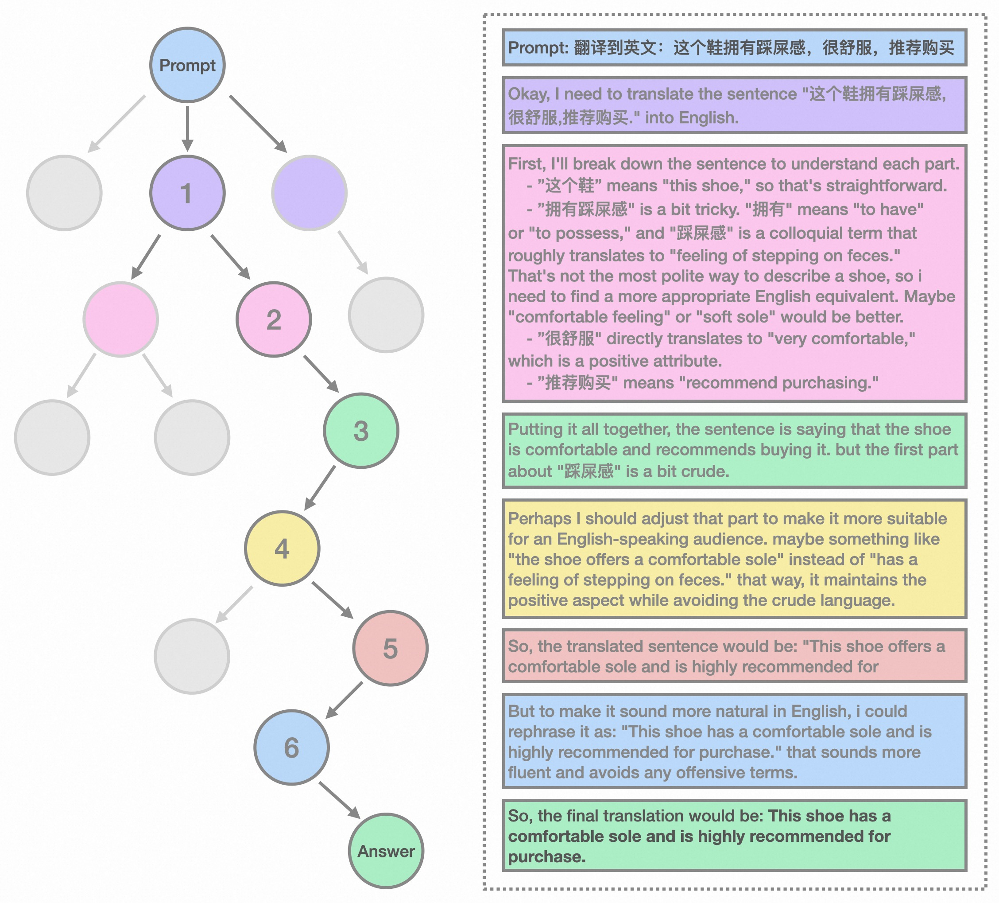

# 提出问题

Can the o1 model effectively generalize to broader domains where clear standards are absent and rewards are challenging to quantify?

# 具体贡献

### Fine-tuning with CoT Data

To develop Marco-o1-CoT by performing full-parameter Supervised Fine-Tuning (SFT) on the base-model using open-source CoT datasets(_Open-O1 Dataset(Filtered)_ ) combined with writer's own synthetic data(_Marco-o1 CoT Dataset(Synthetic), Marco Instruction Dataset_ ).

> How to generate dataset using MCTS?

### Solution Space Expansion via MCTS

- In the MCTS framwwork, **each node represents a reasoning state of the problem-solving process**.
- **The possible actions from a node are the outputs generated by the LLM**. These outputs represent potential steps or mini-steps in the reasoning chain.
- During the rollout phase, **the LLM continues the reasoning process to a terminal state**.
- **The reward score R is used to evaluate and select promising paths within the MCTS.**
- Authors **obtain the value of each state by computing a confidence score.**

> How to calculate confidence score?

$c_i=\frac{e^{p(t_i)}}{\sum_{k=1}^{5}e^{p(t_k)}}$, $v=\frac1n\sum_{i=1}^{n}c_i$

Where $c_i$ is the confidence score for the $i^{th}$ token in the rollout. $p(t_i)$ is the log probability of the $i^{th}$ token generated by the LLM. $p(t_i)$ for $k=1$ to $k=5$ are the log probabilities of the top 5 predicted tokens at the $i^{th}$ step.
$n$ is the total number of tokens in the rollout sequence.

Where $v$ is the overall reward score for the rollout path. **A higher **$\textbf{v}$** indicates a more confident and likely accurate reasoning path.**

### Reasoning Action Strategy

- Step as Action
  The writers allowed the model to generate complete reasoning steps as actions. Each MCTS node represents an entire thought or action label. **This method enables efficient exploration but may miss finer-grained reasoning paths essential for complex problem-solving**.
- Mini-step as Action
  The writers used mini-steps of 32 or 64 tokens as actions. This finer granularity expands the solution space and improves the model’s ability to navigate complex reasoning tasks by considering more nuanced steps in the search process. By exploring the solution space at this level, the model is better equipped to find correct answers that might be overlooked with larger action units.
  While token-level search offers theoretical maximum flexibility and granularity, **it is currently impractical due to the significant computational resources required and the challenges associated with designing an effective reward model at this level**.
- Reflection after Thinking
  Adding the phrase “Wait! Maybe I made some mistakes! I need to rethink from scratch.” at the end of each thought process to introduce a reflection mechanism.

### Application in Translation Tasks

Looking ahead, we aim to refine the reward signal for MCTS through Outcome Reward Modeling (ORM) and Process Reward Modeling (PRM), which will reduce randomness and further improve performance. Additionally, reinforcement learning techniques are being explored to fine-tune the decision-making processes of Marco-o1, ultimately enhancing its ability to tackle complex real-world tasks.
